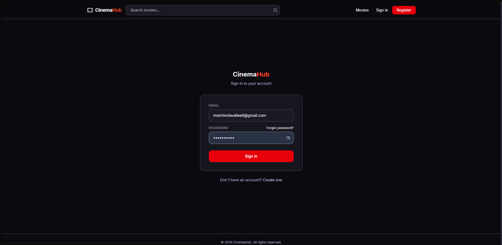
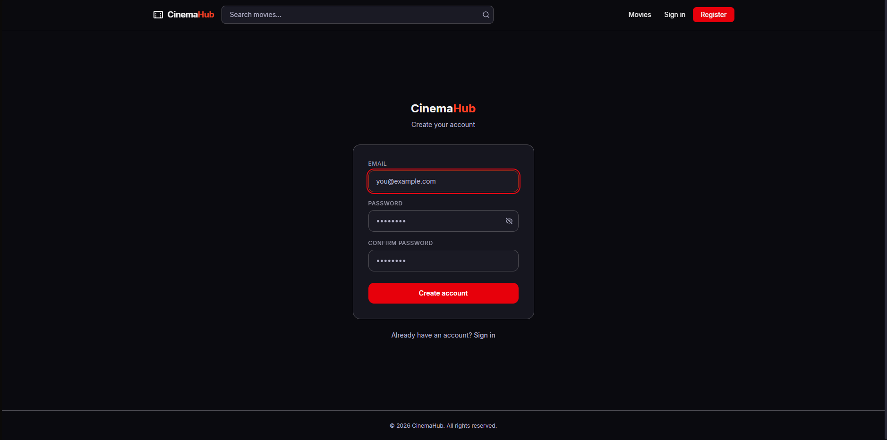
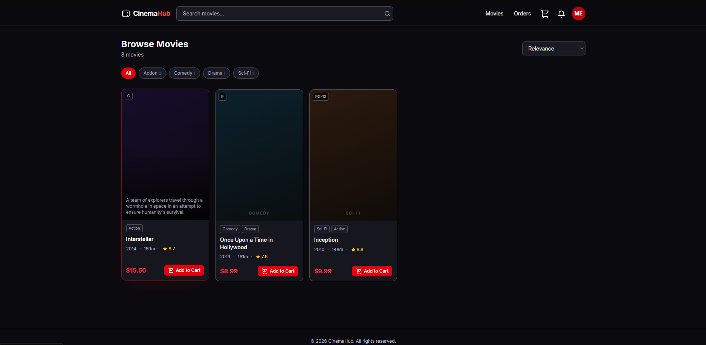
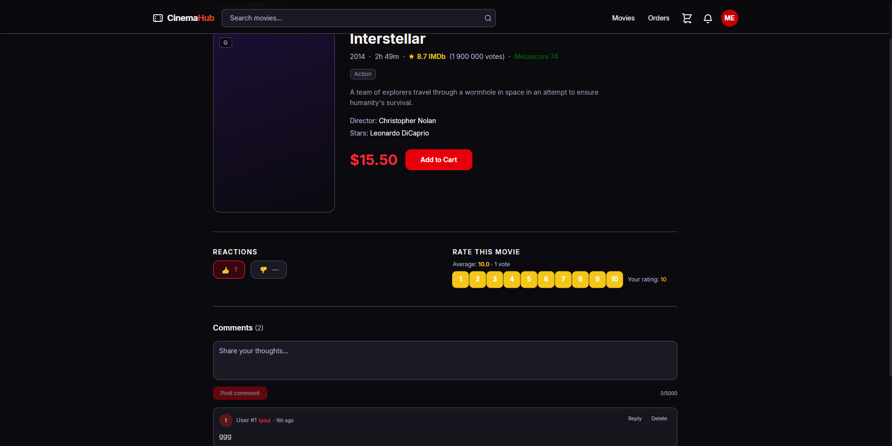
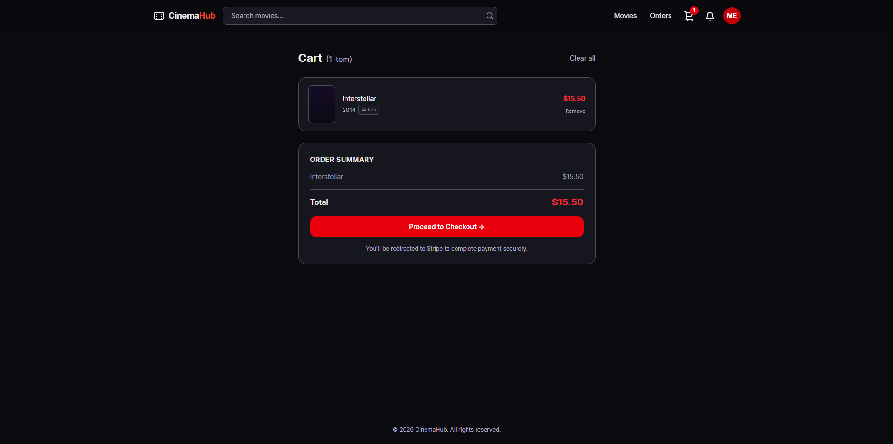
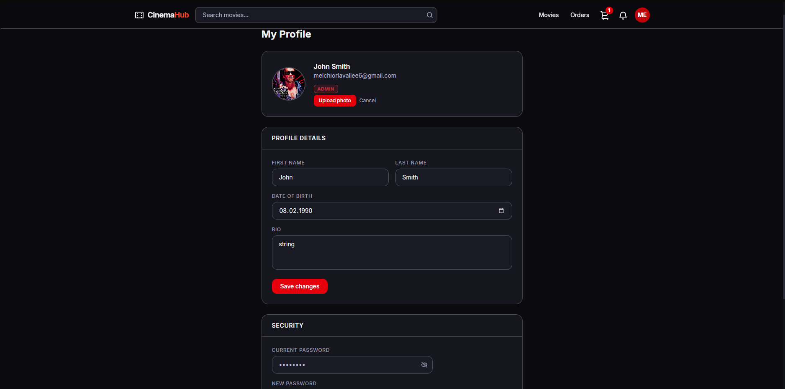

# CinemaHub

An online cinema platform where users can browse, purchase, and manage movies. Includes a full-featured REST API and a React frontend.

---

## Tech Stack

**Backend**
- FastAPI (async) · SQLAlchemy 2.0 (async) · PostgreSQL · Alembic
- Celery + Redis — background tasks and periodic token cleanup
- Stripe — checkout sessions and webhooks
- MinIO/S3 (aioboto3) — avatar storage
- SendGrid — transactional email
- Telegram (aiogram) — admin alerts
- Pydantic v2 · JWT (access + refresh) · bcrypt
- pytest + httpx + SQLite in-memory for tests

**Frontend**
- React 19 · Vite · Tailwind CSS v4
- React Router v7 · Axios · Stripe React

---

## Project Structure

```
src/
├── auth/          # Registration, login, JWT, email activation, password reset, avatar upload
├── movies/        # Movie catalog, genres, stars, directors, certifications
├── interactions/  # Favorites, likes/dislikes, ratings (1–10), comments, notifications
├── cart/          # Per-user cart with duplicate and already-owned-movie guards
├── orders/        # Cart → Order (PENDING) → Stripe → Order (PAID)
├── payments/      # Payment records, Stripe webhook, refunds
├── notifications/ # Email (SendGrid) and Telegram dispatch
├── tasks/         # Celery tasks: email sending, expired-token cleanup (every minute)
└── core/          # Settings, async DB session, S3 service, Celery app, seed script

frontend/
├── src/
│   ├── api/           # Axios client + all API modules (auth, movies, cart, orders, …)
│   ├── context/       # AuthContext (useAuth hook)
│   ├── components/    # Navbar, Footer, MovieCard, Pagination, ProtectedRoute, Spinner
│   └── pages/         # Home, MovieDetail, Login, Register, Activate, Profile,
│                      # Cart, Orders, Notifications, Admin, PaymentSuccess, PaymentCancel
```

---

## Quick Start

### Requirements

- Python 3.12+
- Docker & Docker Compose
- Poetry 2+ — `pip install poetry`
- Node.js 18+

### Backend

```bash
# Clone
git clone <repo-url>
cd online-cinema-fast-api

# Install Python dependencies
poetry install

# Start all services (app, db, redis, worker, beat)
docker-compose up -d --build

# Run migrations and seed the database
docker exec -it cinema_app alembic upgrade head
docker exec -it cinema_app python -m src.core.seed_db
```

API: `http://localhost:8000`
Swagger UI: `http://localhost:8000/docs`

### Frontend

```bash
cd frontend
npm install
npm run dev   # http://localhost:5173
```

---

## Environment Variables

Copy `.env.example` to `.env` and fill in:

| Variable | Description |
|---|---|
| `POSTGRES_*` | Database connection |
| `SECRET_KEY` | JWT signing secret |
| `STRIPE_SECRET_KEY` | Stripe secret key |
| `STRIPE_WEBHOOK_SECRET` | Stripe webhook signing secret |
| `SENDGRID_API_KEY` | SendGrid API key |
| `AWS_*` / `S3_*` | MinIO/S3 credentials and bucket |
| `TELEGRAM_BOT_TOKEN` | Telegram bot for admin alerts |
| `REDIS_URL` | Redis broker URL |

---

## API Overview

All routes are prefixed with `/api/v1`.

| Method | Path | Description |
|---|---|---|
| `POST` | `/user/register/` | Register |
| `POST` | `/user/login/` | Login → access + refresh tokens |
| `POST` | `/user/logout/` | Logout |
| `GET` | `/user/me/` | Current user |
| `GET` | `/movies` | List movies (search, filter, sort, paginate) → `{total, items}` |
| `GET` | `/movies/{id}/` | Movie detail |
| `POST` | `/movies` | Create movie (MODERATOR+) |
| `GET` | `/genres` | List genres with movie counts |
| `POST` | `/genres` | Create genre (MODERATOR+) |
| `GET` | `/stars` | List stars |
| `POST` | `/stars` | Create star (MODERATOR+) |
| `POST` | `/cart/movies/` | Add movie to cart |
| `DELETE` | `/cart/movies/{id}` | Remove from cart |
| `DELETE` | `/cart/movies/` | Clear cart |
| `POST` | `/order/` | Create order → returns `payment_url` |
| `GET` | `/order/my` | My orders |
| `POST` | `/interactions/movies/reaction/` | Like / Dislike |
| `POST` | `/interactions/movies/rating/` | Rate (1–10) |
| `POST` | `/interactions/movies/comments/` | Post comment |
| `GET` | `/interactions/notifications/` | My notifications |

---

## Frontend Pages

| Route | Access | Description |
|---|---|---|
| `/` | Public | Guest hero or authenticated movie grid |
| `/movies/:id` | Auth | Movie detail, reactions, rating, comments |
| `/login` | Public | Sign in |
| `/register` | Public | Register with password strength hints |
| `/activate` | Public | Email activation via token |
| `/profile` | Auth | Avatar, profile details, change password |
| `/notifications` | Auth | In-app notifications, mark as read |
| `/cart` | Auth | Cart items, order summary, Stripe checkout |
| `/orders` | Auth | Order history with status and cancel |
| `/payment/success` | Auth | Post-payment confirmation |
| `/payment/cancel` | Auth | Cancelled payment return |
| `/admin` | Moderator+ | Create genres, stars, movies |

---

## Testing

Tests use an isolated **SQLite in-memory** database — no external services needed.

```bash
# Run all tests
poetry run pytest

# Verbose
poetry run pytest -v

# Single file
poetry run pytest src/tests/test_auth.py -v

# Single test
poetry run pytest src/tests/test_movies.py::test_create_movie_success -v
```

---

## Linting

```bash
poetry run ruff check . --fix
poetry run ruff format .
```

---

## Git Workflow

- Feature branches → `develop` → `main`
- PRs require **2 approvals**
- CI runs Ruff + full pytest suite on push to `develop`/`main` and PRs to `develop`

---

## Database Migrations

```bash
# Apply migrations
docker exec -it cinema_app alembic upgrade head

# Create a new migration after model changes
docker exec -it cinema_app alembic revision --autogenerate -m "description"

# Check current state
docker exec -it cinema_app alembic current
```

## Screenshots








## Demo

[](https://www.youtube.com/watch?v=CLcsIiTjtX8&t=1s)